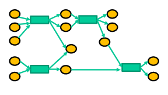
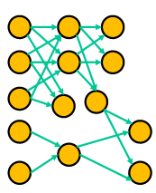
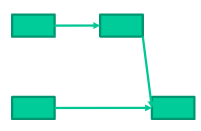

# Bitcoin Graph
To get Bitcoin graph, import 
<b>getGraph(dd, mm, yy, dOffset,graphType)</b> function from getAPIData. 
 

* To get the <b>COMPOSITE</b> graph object:  
 Suppose you want a COMPOSITE graph for 10 days from date February 9, 2009 then : 
    * Inputs:   
dd = 9   
mm = 2  
yy = 2009   
dOffset = 10  
graphType = COMPOSITE
    * Output:
Two values will be returned: 
        * "Success"/"Fail" 
        * The composite graph in the form of object of <b>MultiDiGraph</b>
    * Here, edges of the graph will be of 2 types:
        * "From:" Address, "To:" Transaction hash, Amount
        * "From:" Transaction hash, "To:" Address, Amount

One can differentiate Transaction hash by its length, which is 64.
   

* To get the <b>ADDRESS</b> graph object:  
 Suppose you want a ADDRESS graph for 10 days from date February 9, 2009 then : 
    * Inputs:   
dd = 9   
mm = 2  
yy = 2009   
dOffset = 10  
graphType = ADDRESS
    * Output:
Two values will be returned: 
        * "Success"/"Fail" 
        * The address graph in the form of object of <b>MultiDiGraph</b>
    * Here, edges of the graph will be of only 1 type:
        * "From:" Address, "To:" Address, Amount
      

* To get the <b>TRANSACTION</b> graph object:  
 Suppose you want a TRANSACTION graph for 10 days from date February 9, 2009 then : 
    * Inputs:   
dd = 9   
mm = 2  
yy = 2009   
dOffset = 10  
graphType = TRANSACTION
    * Output:
Two values will be returned: 
        * "Success"/"Fail" 
        * The transaction graph in the form of object of <b>MultiDiGraph</b>
    * Here, edges of the graph will be of only 1 type:
        * "From:" Transaction, "To:" Transaction, Amount
        
        

# Analysis

To get any feature, import
<b>getFeatures(dd,mm,yy,"Feature")</b> function from addressFeatures.
 

* To get the <b>LEVEL_OF_ACTIVITY</b> for each address:  
 Suppose you want a LEVEL_OF_ACTIVITY for date February 9, 2009 then : 
    * Inputs:  
dd = 9   
mm = 2  
yy = 2009   
Feature = LEVEL_OF_ACTIVITY 
*   Output:
Two values will be returned: 
    * "Success"/"Fail" 
    * The data will be provided in form of dataframe object where each row will corresponds to  ["Address","Value"] 
       

Note : Different features are : 
* The Feature :LEVEL_OF_ACTIVITY 
* The Feature : TOTAL_BTC_RECEIVED 
* The Feature : TOTAL_BTC_SENT 
* The Feature :CURRENT_BALANCE

##Note: The data retrieved will be on daily basis

# Ethereum Graph
To get Ethereum graph, import 
<b>getEthereumgraph(24, 4, 2018, 1, "zrx")</b> function from graph.getGraph.ethereumGraph.getAPIData import getEthereumgraph. 
 

<h6>References</h6>
[1] Images from "Data Science on Blockchain", UM Learn, Cuneyt Gurcan Akcora
